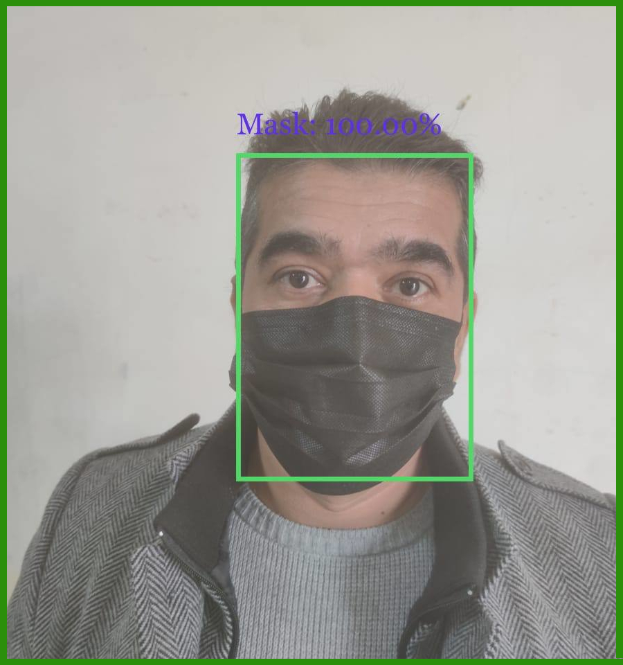
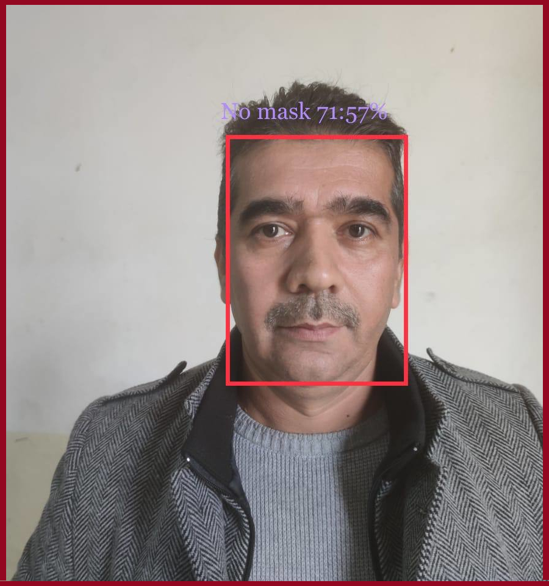

# Project: Real-Time Face Mask Detection

# Overview
Face Mask Detection System built with OpenCV, Keras/TensorFlow using Deep Learning and Computer Vision:

A Face Mask Detector using Keras, Tensorflow, MobileNet and OpenCV.  
These types of models could be integrated with CCTV cameras to detect and identify people without masks.

The model is accurate, and since the MobileNetV2 architecture is used, it’s also computationally efficient and thus making it easier to deploy the model to embedded systems (Raspberry Pi, Google Coral, etc.).

This system can therefore be used in real-time applications which require face-mask detection for safety purposes due to the outbreak of Covid-19. 
This project can be integrated with embedded systems for application in airports, railway stations, offices, schools, and public places to ensure that public safety guidelines are followed.

# Dependencies / Frameworks
This project requires Python 3.8 or 3.9 and the following Python libraries installed:

* OpenCV-python
* Caffe-based face detector
* Keras
* TensorFlow
* MobileNetV2
* scikit-learn
* Matplotlib
* imutils
* Pandas & numpy

# Results:
## 1. Loss & Accuracy curves:
   

## 2. Evaluation:

## 3. Classification Report:

### 4. Wearing Mask:

### 5. Not Wearing a Mask:

## Credits
1. [GitHub](http://github.com)
2. [Stackoverflow](https://stackoverflow.com)
3. [Kaggle](https://www.kaggle.com/)
